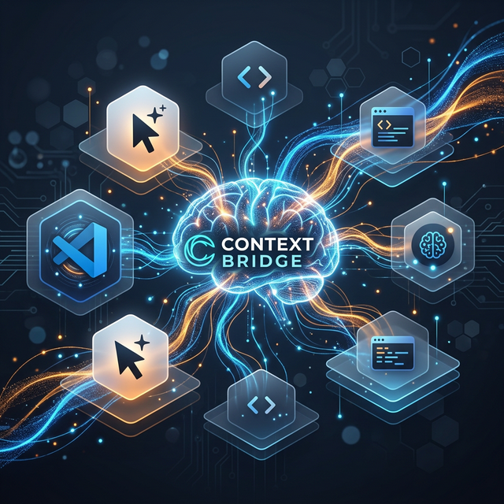

<div align="center">

# 🔌 Context Bridge

**The Shared Universal Memory for AI Coding Tools**

[](https://opensource.org/licenses/MIT)
[](https://modelcontextprotocol.io)

</div>

<br>

If you use **Cursor**, **VS Code** (Copilot/Cline/Roo Code), **OpenCode**, and **Antigravity**, you know they don't talk to each other. *If Cursor fixes a bug, VS Code doesn't know about it.*

**Context Bridge solves this.** It runs a blazingly fast local SQLite database that all your AI tools read and write to.

<br>

<div align="center">
  
</div>

---

## ✨ Features and Superpowers

Context Bridge gives your AI tools two game-changing superpowers:

### 1. Global Universal Memory (Everywhere)
Teach your AI something *once*, and it remembers it for *every project, forever*.
* *Example:* "I prefer TypeScript over JavaScript"
* *Example:* "I deploy all my production apps on Vercel" 
* Whenever you start a new conversation, the AI instantly knows your universal preferences, saving you endless repetition.

### 2. Per-Project Context (Local)
Your AI tools leave persistent notes for each other inside a specific project.
* *Example:* Cursor figures out how an undocumented API works and leaves a context note. Later, VS Code reads that note instead of hallucinating from scratch.
* *Example:* The AI logs a compressed version of your chat history. So if you switch from Antigravity to Cursor mid-task, Cursor can read exactly what files you've been working on, and what the last result was.

### 🚀 Optimized for Token Savings (v2.0)
Context Bridge leverages **SQLite FTS5 (Full-Text Search) with BM25 Ranking** to instantly pull up the most mathematically relevant context notes, preventing your AI from filling its context window with junk. 

We also run aggressive algorithmic compression on all logged chat sessions, shrinking conversational fluff (`"I'd be happy to help!"`, `"Before we begin..."`) and aggressively abbreviating common programming terms (`request` -> `req`, `configuration` -> `cfg`) before saving them to the database.

---

## ⚡ 1-Minute Setup

You don't need any complex configuration. Run this command in your terminal:

```bash
bash <(curl -s https://raw.githubusercontent.com/Tide-Trends/context-bridge/main/setup.sh)
```

**What this does:**
1. Downloads the server to `~/.context-bridge`
2. Automatically configures **Cursor** and **VS Code (Copilot, Cline, & Roo Code)** to connect to the MCP server.

### 📜 The Final Step
Your AI tools need to know the "rules of the game". Open the [`PROMPTS.md`](PROMPTS.md) file and paste the specific prompt for your tool into your AI system rules.

---

## 🛠️ How it works under the hood

Context Bridge relies on the [Model Context Protocol (MCP)](https://modelcontextprotocol.io). 

It sits on an ultra-lightweight SQLite database locally on your machine. All your AI tools connect to it simultaneously (using `stdio` and WAL mode for safe concurrency). 

| Tool Category | What the AI can do via MCP |
|---------------|--------------------|
| **🧠 Global Memory** | `remember`, `recall`, `forget` universal facts across all projects. |
| **📁 Project Chat** | `log_chat`, `get_chat` to pick up conversations exactly where you left off. |
| **💡 Shared Notes** | `share_context`, `search_contexts` to leave architectural decisions and TODOs, ranked by FTS5 BM25. |

### Manual Installation (Optional)

If you prefer building from source rather than using the automated setup script:

```bash
git clone https://github.com/Tide-Trends/context-bridge.git ~/.context-bridge/server
cd ~/.context-bridge/server && npm install
```

Then configure your MCP engine to run:
`node ~/.context-bridge/server/src/index.js`
